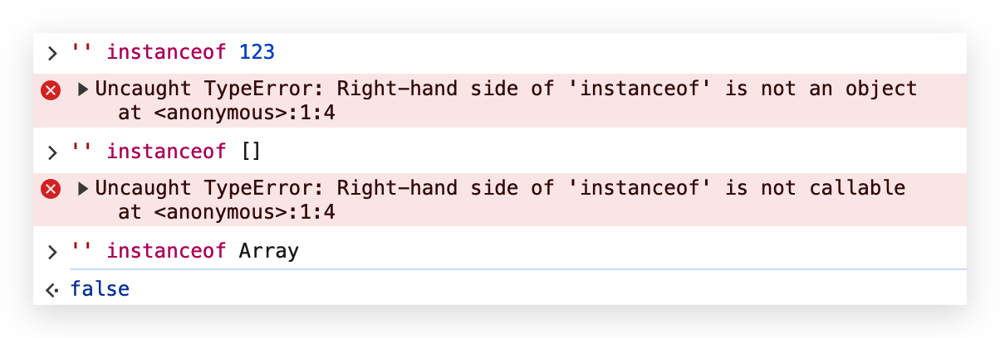
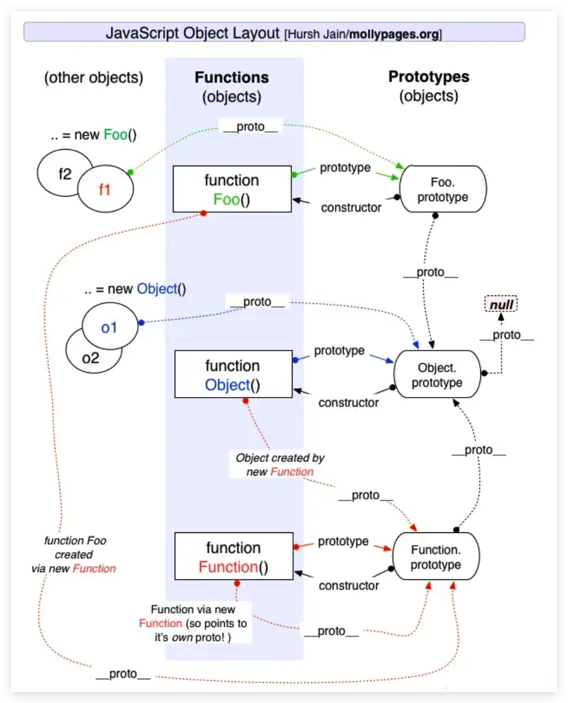
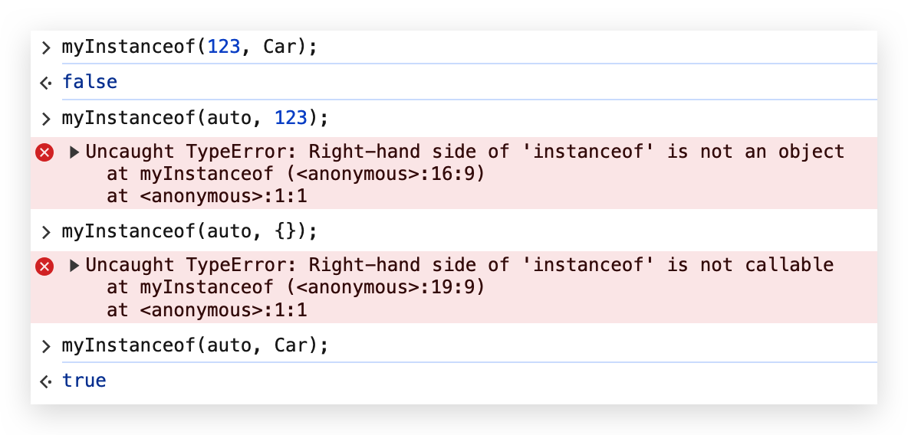

在前端面试中，`instanceof` 是一个常见的问题。面试官通常会要求面试者手写 `instanceof` 的实现，以测试他们对 JavaScript 类型系统和原型链的理解。

<!-- truncate -->

---

## 类型判断

在 JavaScript 中数据分为基本类型和引用类型。

- 基本类型
  - `Number`
  - `String`
  - `Boolean`
  - `undefined`
  - `null`
  - `Symbol`
  - `BigInt`
- 引用类型
  - `Object`
  - `Array`
  - `Function`
  - `Date`
  - `RegExp`
  - `Map`、`Set`
  - `Promise`
  - `...`

在实际工作中，我们常常需要判断一个变量的类型。对于基本类型(`null` 除外) 和 `Function` 我们可以使用 `typeof` 进行判断。对于引用类型我们则需要使用 `instanceof` 进行判断。

```js
// 基本数据类型
let numberExample = 123;
let stringExample = "hello";
let booleanExample = true;
let nullExample = null;
let undefinedExample = undefined;
let symbolExample = Symbol("example");
let bigIntExample = BigInt(10);

// 引用类型
let objectExample = {};
let arrayExample = [];
let functionExample = function () {};
let dateExample = new Date();
let regExpExample = /abc/;
let mapExample = new Map();
let setExample = new Set();
let promiseExample = new Promise(() => {});

// typeof 适用范围
console.log(typeof numberExample); // number
console.log(typeof stringExample); // string
console.log(typeof booleanExample); // boolean
console.log(typeof undefinedExample); // undefined
console.log(typeof symbolExample); // symbol
console.log(typeof bigIntExample); // bigint
console.log(typeof functionExample); // function

// typeof 对 null 和于其他引用类型无法判断
console.log(typeof nullExample); // object。这是一个历史遗留问题，实际上 null 是基本数据类型
console.log(typeof objectExample); // object
console.log(typeof arrayExample); // object
console.log(typeof dateExample); // object
console.log(typeof regExpExample); // object
console.log(typeof mapExample); // object
console.log(typeof setExample); // object
console.log(typeof promiseExample); // object

// instanceof 判断对象具体是哪种类型的对象
console.log(objectExample instanceof Object); // true
console.log(arrayExample instanceof Array); // true
console.log(functionExample instanceof Function); // true
console.log(dateExample instanceof Date); // true
console.log(regExpExample instanceof RegExp); // true
console.log(mapExample instanceof Map); // true
console.log(setExample instanceof Set); // true
console.log(promiseExample instanceof Promise); // true
```

---

## instanceof 是什么

MDN 定义: `instanceof` 是 JavaScript 的一个二元操作符，用于测试构造函数的 `prototype` 属性是否出现在对象的原型链中的任何位置。换句话说，instanceof 可以用于判断一个对象是否由某个构造函数创建的。

```js
function Car(make, model, year) {
  this.make = make;
  this.model = model;
  this.year = year;
}

const auto = new Car("Honda", "Accord", 1998);
console.log(auto instanceof Car); // true
```

在这个例子中，auto 是 Car 的一个实例，所以 `auto instanceof Car` 返回 `true`。

> 注意：左侧可以是任意类型，而右侧必须是一个函数的实例。参数错误时会报错。
> 

---

## instanceof 原理

每个对象都有一个 `__proto__` 属性。在对象创建的时候会将 `__proto__` 属性指向它的构造函数的 `prototype` 属性上。并且构造函数的 `prototype` 属性本身也是一个对象。它也有自己的 `__proto__` 属性。通过 `__proto__` -> `prototype` 这样串联形成一个链条，这个链条就是原型链。原型链的终点是 `Object`，`Object.prototype.__proto__` 的值为 `null`。

每个对象的构造函数都可以在原型链上找到，因此 `instanceof` 通过原型链可以判断对象是否由某个构造函数创建。



---

## 实现一个 instanceof

### 手写 instanceof

手写 `instanceof` 的实现可以帮助我们更深入地理解 JavaScript 的原型链。下面是一个简易的 `instanceof` 实现：

1. 参数校验
2. 比较 `obj.__proto === constructor.prototype`
   1. 找到就立即返回 `true`
   2. 遍历到原型链终点 `constructor.prototype === null` 时，返回 `false`

```js
function myInstanceof(obj, constructor) {
  const BASIC_TYPE = [
    "[object Undefined]",
    "[object Null]",
    "[object Number]",
    "[object String]",
    "[object Boolean]",
    "[object Symbol]",
    "[object BigInt]",
  ];

  const objType = Object.prototype.toString.call(obj);
  const constructorType = Object.prototype.toString.call(constructor);

  if (BASIC_TYPE.includes(constructorType)) {
    throw TypeError("Right-hand side of 'instanceof' is not an object");
  }
  if (typeof constructor !== "function") {
    throw TypeError("Right-hand side of 'instanceof' is not callable");
  }
  if (BASIC_TYPE.includes(objType)) {
    return false;
  }

  let objProto = Reflect.getPrototypeOf(obj);
  while (objProto !== null) {
    if (Object.is(objProto, constructor.prototype)) {
      return true;
    }
    objProto = Reflect.getPrototypeOf(obj);
  }
  return false;
}
```

> 当传入的参数是对象时，如果操作成功  `Reflect.getPrototypeOf(target)`  返回对象的原型，如果操作失败（比如，目标不是对象）则返回  `false`。

### 测试结果



---

## 总结

本文介绍了 JavaScript 类型判断的方法。对 `instanceof` 的概念、用法和实现进行了介绍。

# 资料

- [instanceof - JavaScript | MDN](https://developer.mozilla.org/zh-CN/docs/Web/JavaScript/Reference/Operators/instanceof)
