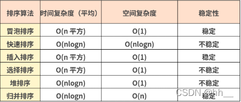
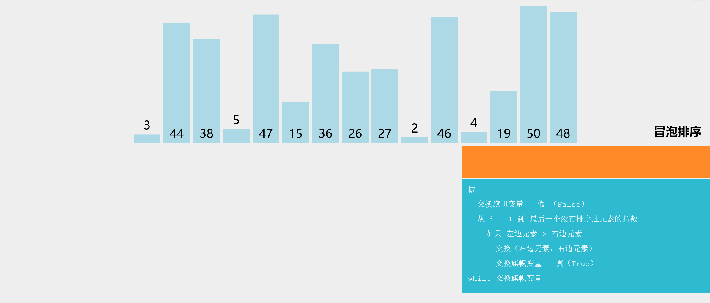
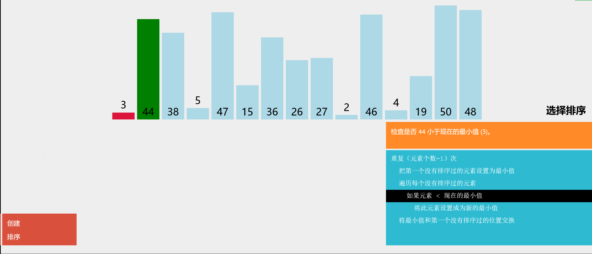
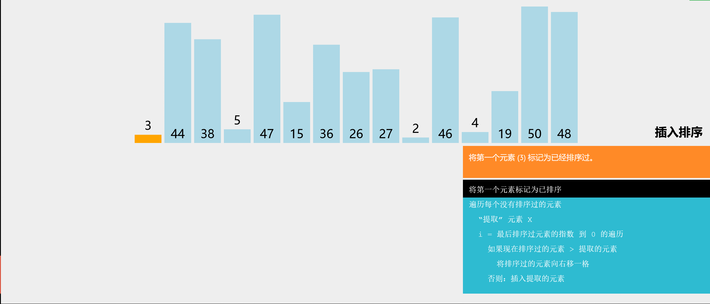
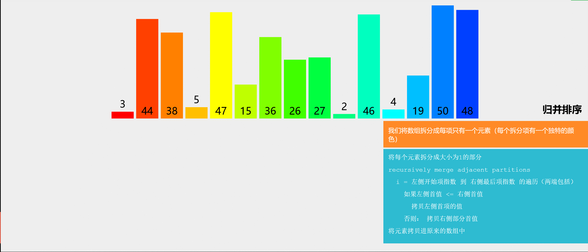
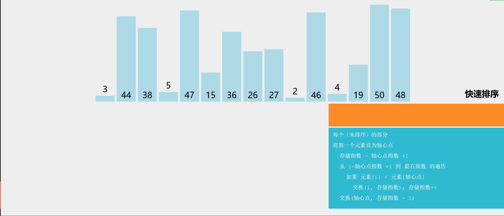

import LinkList from "@site/src/components/LinkList";
import algorithm from "@site/static/img/icon/algorithm.png";

## 概览




## 冒泡排序

1. 比较所有相邻元素,如果第一个比第二个大，则交换它们
2. 一轮下来保证可以找到一个数是最大的
3. 执行n-1轮，就可以完成排序

复杂度分析：

- 每次遍历，有序区的元素都会+1。有序区的元素达到 n 个。因此复杂度为：O(n^2)



```js
//定义一个原生的bubbleSort方法
Array.prototype.bubbleSort = function () {
    for(let i = 0; i < this.length - 1; i += 1) {
        // 通过 this.length 次把第一位放到最后,完成排序
        // -i是因为最后的位置是会动态改变的，当完成一次后,最后一位会变成倒数第二位。
        for(let j = 0; j < this.length - 1 - i; j += 1) { 
            if(this[j] > this[j+1]) { 
                const temp = this[j];
                this[j] = this[j+1];
                this[j+1] = temp;
            }
        }
    }
}

const arr = [4,8,0,1,43,53,22,11,0];
arr.bubbleSort();
console.log(arr);
```

## 选择排序

1. 找到数组中的最小值，选中它并将其放置在第一位
2. 接着找到第二个最小值，选中它并将其放置到第二位
3. 执行n-1轮，就可以完成排序

复杂度分析：

- 每次遍历，有序区的元素都会+1。有序区的元素达到 n 个。因此复杂度为：O(n^2)



```js
Array.prototype.selectionSort = function() { 
    for(let i = 0; i < this.length - 1; ++i) { 
        // 假设最小的值是当前的下标
        let indexMin = i;
        //遍历剩余长度找到最小下标
        for(let j = i; j < this.length; ++j) { 
            if(this[j] < this[indexMin] ) { 
                indexMin = j;
            }
        }
        if(indexMin !== i) { 
            //交换当前下标i与最小下标的值，重复this.length次
            const temp = this[i];
            this[i] = this[indexMin];
            this[indexMin] = temp;
        }
    }
};


const arr = [5,4,3,2,1];
arr.selectionSort();
console.log(arr);
```

## 插入排序

1. 从第二个数开始往前比
2. 比它大就往后排
3. 以此类推进行到最后一个数



```js
Array.prototype.insertionSort = function() { 
    //从第二个数开始往前比
    for(let i = 1; i<this.length; ++i) { 
        //先把值保存起来
        const temp = this[i];
        let j = i;
        while(j > 0) { 
            if(this[j-1] > temp) { 
                this[j] = this[j-1];
            } else { 
                //因为已经是排序过的了，如果比上一位大，那就没必要再跟上上位比较了
                break;
            }
            j -= 1;
        }
        //这里的j有可能是第0位，也有可能是到了一半停止了
        this[j] = temp;
    }
};

const arr = [5,4,3,2,1];
arr.insertionSort();
```

## 归并排序

分: 把数组劈成两半，再递归地对数组进行“分”操作，直到分成一个个单独的数
合：把两个数合并为有序数组，再对有序数组进行合并，直到全部子数组合并为一个完整数组



```js
Array.prototype.mergeSort = function () { 
    const rec = (arr) => {
        //如果数组长度为1，说明切完了，可以直接返回
        if (arr.length === 1) { return arr; }
        //切分数组，把每一项都单独切出来
        const mid = Math.floor(arr.length / 2);
        const left = arr.slice(0,mid);
        const right = arr.slice(mid,arr.length);
        //有序的左边数组
        const orderLeft = rec(left);
        //有序的右边数组
        const orderRight = rec(right);
        //定义一个数组来存放顺序数组
        const res = [];
        // 把左右两个有序的合并为一个有序的返回
        while(orderLeft.length || orderRight.length) { 
            if(orderLeft.length && orderRight.length) { 
                res.push(orderLeft[0] < orderRight[0] ? orderLeft.shift() : orderRight.shift())
            } else if (orderLeft.length) { 
                res.push(orderLeft.shift());
            } else if (orderRight.length) { 
                res.push(orderRight.shift());
            }
        }
        return res;
    };
    const res = rec(this);
    //拷贝到数组本身
    res.forEach((n,i) => { this[i] = n; });
}


const arr = [5,4,3,2,1];
arr.mergeSort();
console.log(arr);
```

## 快速排序

分区: 从数组中任意选择一个基准，所有比基准小的元素放到基准前面，比基准大的元素放到基准的后面
递归：递归地对基准前后的子数组进行分区



```js
Array.prototype.quickSort = function () { 
    const rec = (arr) => { 
       // 预防数组是空的或者只有一个元素, 当所有元素都大于等于基准值就会产生空的数组
       if(arr.length === 1 || arr.length === 0) { return arr; }
       const left = [];
       const right = [];
       //以第一个元素作为基准值   
       const mid = arr[0];
       //小于基准值的放左边，大于基准值的放右边
       for(let i = 1; i < arr.length; ++i) { 
           if(arr[i] < mid) { 
               left.push(arr[i]);
           } else { 
               right.push(arr[i]);
           }
       }
        //递归调用，最后放回数组    
       return [...rec(left),mid,...rec(right)];
    };
    const res = rec(this);
    res.forEach((n,i) => { this[i] = n; })
}


const arr = [2,3,4,5,3,1];
arr.quickSort();
console.log(arr);
```


## 堆排序

```js
var a = [1, 3, 6, 3, 23, 76, 1, 34, 222, 6, 456, 221];
 
function heap_sort(arr) {
  var len = arr.length
  var k = 0
  function swap(i, j) {
    var temp = arr[i]
    arr[i] = arr[j]
    arr[j] = temp
  }
 
  function max_heapify(start, end) {
    var dad = start
    var son = dad * 2 + 1
    if (son >= end) return
    if (son + 1 < end && arr[son] < arr[son + 1]) {
      son++
    }
 
    if (arr[dad] <= arr[son]) {
      swap(dad, son)
      max_heapify(son, end)
    }
  }
 
  for (var i = Math.floor(len / 2) - 1; i >= 0; i--) {
    max_heapify(i, len)
  }
 
 
 
  for (var j = len - 1; j > k; j--) {
    swap(0, j)
    max_heapify(0, j)
  }
  return arr
 
}
 
heap_sort(a); // [1, 1, 3, 3, 6, 6, 23, 34, 76, 221, 222, 456]
```

