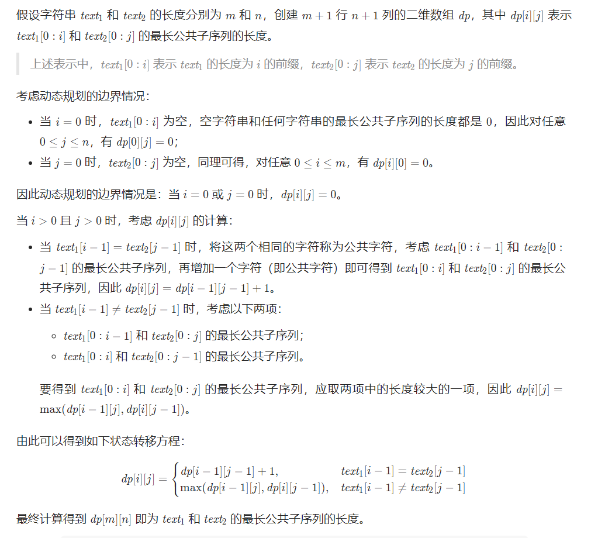

[1143. 最长公共子序列](https://leetcode.cn/problems/longest-common-subsequence/)

给定两个字符串  text1 和  text2，返回这两个字符串的最长 公共子序列 的长度。如果不存在 公共子序列 ，返回 0 。

一个字符串的   子序列   是指这样一个新的字符串：它是由原字符串在不改变字符的相对顺序的情况下删除某些字符（也可以不删除任何字符）后组成的新字符串。

例如，"ace" 是 "abcde" 的子序列，但 "aec" 不是 "abcde" 的子序列。
两个字符串的 公共子序列 是这两个字符串所共同拥有的子序列。

示例 1：

```
输入：text1 = "abcde", text2 = "ace"
输出：3
解释：最长公共子序列是 "ace" ，它的长度为 3 。
```

示例 2：

```
输入：text1 = "abc", text2 = "abc"
输出：3
解释：最长公共子序列是 "abc" ，它的长度为 3 。
```

示例 3：

```
输入：text1 = "abc", text2 = "def"
输出：0
解释：两个字符串没有公共子序列，返回 0 。
```

## 解析

计算最长公共子序列（Longest Common Subsequence，简称 LCS）是一道经典的动态规划题目。比如说输入 s1 = "zabcde", s2 = "acez"，它俩的最长公共子序列是 lcs = "ace"，长度为 3，所以算法返回 3。

如果没有做过这道题，一个最简单的暴力算法就是，把 s1 和 s2 的所有子序列都穷举出来，然后看看有没有公共的，然后在所有公共子序列里面再寻找一个长度最大的。显然，这种思路的复杂度非常高，你要穷举出所有子序列，这个复杂度就是指数级的，肯定不实际。

**正确的思路是不要考虑整个字符串，而是细化到 s1 和 s2 的每个字符**。

最长公共子序列问题是典型的二维动态规划问题。构建二维数组去做。




## 代码实现

```js
var longestCommonSubsequence = function (text1, text2) {
  const m = text1.length,
    n = text2.length;
  const dp = new Array(m + 1).fill(0).map(() => new Array(n + 1).fill(0));
  for (let i = 1; i <= m; i++) {
    const c1 = text1[i - 1];
    for (let j = 1; j <= n; j++) {
      const c2 = text2[j - 1];
      if (c1 === c2) {
        dp[i][j] = dp[i - 1][j - 1] + 1;
      } else {
        dp[i][j] = Math.max(dp[i - 1][j], dp[i][j - 1]);
      }
    }
  }
  return dp[m][n];
};
```

## 复杂度分析

- 时间复杂度：O(mn)
- 空间复杂度：O(mn)

其中 m 和 n 分别是字符串 text1 和 text2 的长度。
