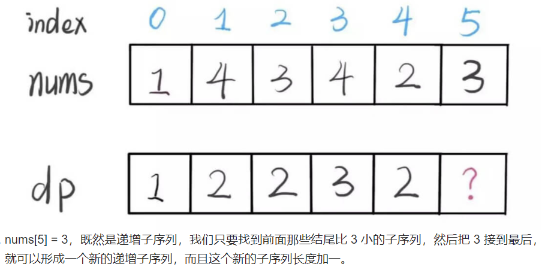

[300. 最长递增子序列](https://leetcode.cn/problems/longest-increasing-subsequence/)

给你一个整数数组 nums ，找到其中最长严格递增子序列的长度。

子序列   是由数组派生而来的序列，删除（或不删除）数组中的元素而不改变其余元素的顺序。例如，[3,6,2,7] 是数组 [0,3,1,6,2,2,7] 的子序列。


示例  1：

```
输入：nums = [10,9,2,5,3,7,101,18]
输出：4
解释：最长递增子序列是 [2,3,7,101]，因此长度为 4 。
```

示例 2：

```
输入：nums = [0,1,0,3,2,3]
输出：4
```

示例 3：

```
输入：nums = [7,7,7,7,7,7,7]
输出：1
```

## 解析

`dp` 数组的定义：`dp[i]` 表示以 `nums[i]` 这个数结尾的最长递增子序列的长度。

那么 `dp` 数组中最大的那个值就是最长的递增子序列长度。

假设我们已经知道了 dp[0..4] 的所有结果，我们如何通过这些已知结果推出 dp[5] 呢？



## 代码实现

```js
/**
 * @param {number[]} nums
 * @return {number}
 */
var lengthOfLIS = function (nums) {
  const dp = new Array(nums.length).fill(1);
  for (let i = 0; i < nums.length; i++) {
    // i与i前面的元素比较
    for (let j = 0; j < i; j++) {
      // 找比i小的元素，找到一个，就让当前序列的最长子序列长度加1
      if (nums[i] > nums[j]) {
        dp[i] = Math.max(dp[i], dp[j] + 1);
      }
    }
  }
  // 找出最大的子序列
  return Math.max(...dp);
};
```
