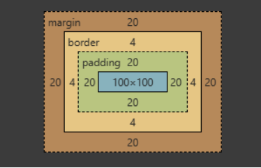

import ReferenceList from "@site/src/components/ReferenceList";

盒模型用于表示每一个 HTML 元素，盒模型允许我们在其它元素和周围元素边框之间的空间放置元素。盒模型由四部分构成。由内到外分别是内容（Content）、内边距（Padding）、边框（Border）和外边距（Margin）。CSS 中组成一个块级盒子需要:

- Content box（内容）: 这个区域是用来显示内容，大小可以通过设置 width 和 height
- Padding box（内边距）: 包围在内容区域外部的空白区域； 大小通过 padding 相关属性设置
- Border box（边框）: 边框盒包裹内容和内边距。大小通过 border 相关属性设置
- Margin box（外边距）: 这是最外面的区域，是盒子和其他元素之间的空白区域。大小通过 margin 相关属性设置

:::caution Tip

背景图片作用于盒模型中除去外边距的部分

:::

## `box-sizing`

`box-sizing` 属性决定着如何计算**元素的总宽度和高度**。默认情况下，指定的宽度和高度只会应用到 **Content Box**。

- `content-box(默认值)` - 指定的宽度和高度即为 Content Box 的宽度和高度。如果元素还拥有 Margin，Padding 或 Border，那么该盒模型的总宽高会超出 Content Box 的区域。
- `border-box` - 指定的宽度和高度为 Border Box 的宽度和高度，覆盖该盒模型的 Padding，Border 和 Content，如果有 Padding 和 Border，那么 Content 的宽高会被挤压。

### 默认属性为 `border-box` 的元素

- `<table>`
- `<select>`
- `<button>`
- `<input> (当且仅当属性 type 满足如下)`
  - `radio`
  - `checkbox`
  - `reset`
  - `button`
  - `submit`
  - `color`
  - `search`

### 作用：便于布局元素

- 使用 `border-box` 时，可以在计算宽高时**避免一些因为 Padding 和 Border 产生的陷阱**（盒模型的实际宽高超过了 Content Box 的宽高）。
- 在使用相对定位和绝对定位时，使用 `content-box`，可以**使子元素相对于父元素的 Content Box 定位**，从而避免 Padding、Border、Margin 对的影响。

## 参考

<ReferenceList
  data={[
    {
      title: "盒模型詳解",
      link: "https://blog.csdn.net/langmanboy/article/details/124022601",
    },
  ]}
/>
