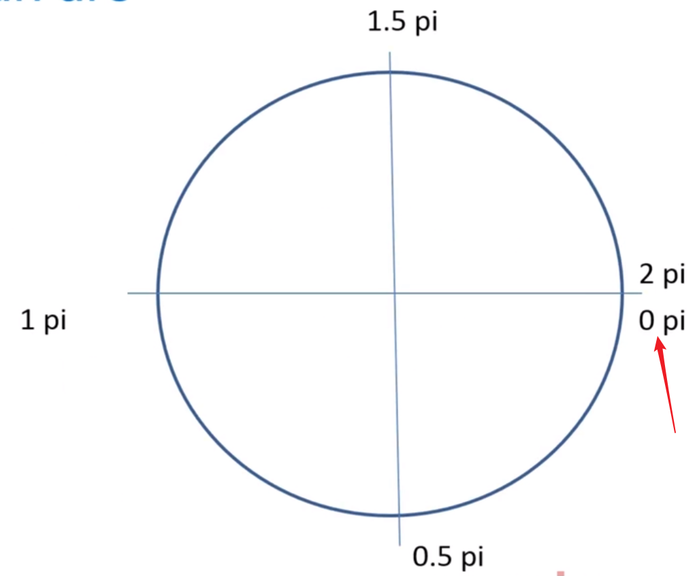
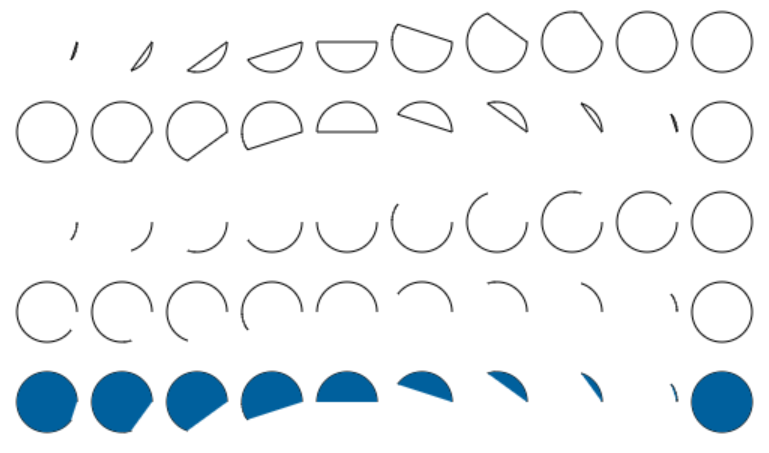
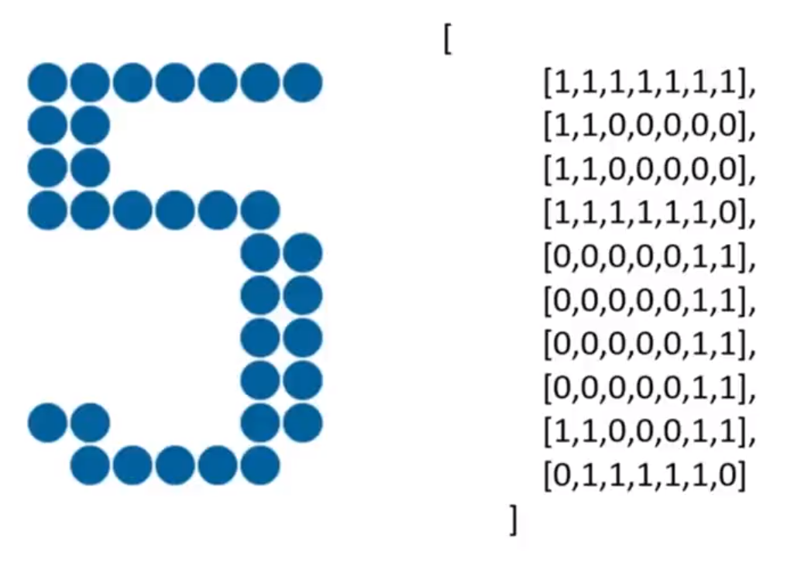
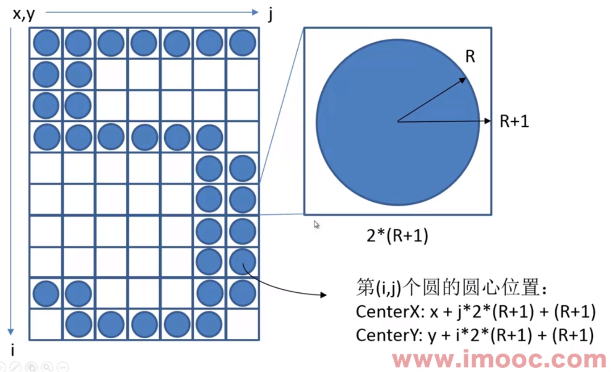

import ReferenceList from "@site/src/components/ReferenceList";
import FeatureIcon from "@site/src/components/FeatureIcon";
import LinkList from "@site/src/components/LinkList";
import html from "@site/static/img/icon/html.png";

<FeatureIcon src={html} title="Canvas" />


## Canvas 简介

Canvas 本质上就是 HTML 的一个标签。`canvas` 标签有默认大小，如果需要设置画布大小可以通过 `width` 和 `height`

```html
<canvas id="canvas" width="1024" height="768" style="border: 1px solid #aaa;">
```


## 绘制上下文

Canvas 画图时使用的是 `context` 进行绘制。通过 `getContext("2d")` 得到绘图上下文``context`。

```js
var canvas = document.getElementById("canvas");
var context = canvas.getContext("2d") // 如果获取不到 context 说明浏览器不支持 canvas
```


## 绘制直线

**Canvas 中的绘图是基于状态的绘图。先声明绘图的状态，然后再调用方法进行绘图。**在调用绘制方法前的所有状态都会合并生效。

```js
// Draw a line
// 状态设置。可以设置多个状态，然后统一调用绘制方法。
context.moveTo(100, 100) // 将画笔移动至 100, 100 处
context.lineTo(200, 200) // 从起点画一条线到 200,200
context.lineTo(100, 200) // 继续画线到 100,200

context.lineWidth = 5;
context.strokeStyle = "#aaa";
context.stroke() // 绘制
```


`context.moveTo(x,y)`：标记画笔位置在 (x,y)

`context.lineTo(x,y)`：画线至 (x,y)


`context.lineWidth`：设置线宽

`context.fillStyle`：填充颜色

`context.strokeStyle`：笔画颜色，可以使用 CSS


`context.stroke()`：笔画，绘制线条

`context.fill()`：填充，会自动把路径封闭


`context.beginPath()`：开启画图，表明重新开始规划一短路径

`context.closePath()`：关闭画图，会自动将未封闭的图形封闭

[七巧板链接](https://codesandbox.io/s/cocky-heisenberg-c2cvqk?file=/%E4%B8%83%E5%B7%A7%E6%9D%BF.html)


## 绘制圆弧

```javascript
context.arc(
	centerx, centery, radius, startingAngle, endingAngle, anticlockwise = false
)
```

第六个参数 `anticlockwise` 默认是 false 顺时针判断




```javascript
for (let i = 0; i < 10; i++) {
    context.beginPath()
    context.arc(50 + i * 50, 100, 20, 0, 2 * Math.PI * (i + 1) / 10)
    context.closePath();
    context.stroke()
}

for (let i = 0; i < 10; i++) {
    context.beginPath()
    context.arc(50 + i * 50, 160, 20, 0, 2 * Math.PI * (i + 1) / 10, true)
    context.closePath();
    context.stroke()
}

for (let i = 0; i < 10; i++) {
    context.beginPath()
    context.arc(50 + i * 50, 220, 20, 0, 2 * Math.PI * (i + 1) / 10)
    context.stroke()
}

for (let i = 0; i < 10; i++) {
    context.beginPath()
    context.arc(50 + i * 50, 280, 20, 0, 2 * Math.PI * (i + 1) / 10, true)
    context.stroke()
}

context.fillStyle = "#00609d"
for (let i = 0; i < 10; i++) {
    context.beginPath()
    context.arc(50 + i * 50, 340, 20, 0, 2 * Math.PI * (i + 1) / 10, true)
    context.stroke()
    context.fill()
}
```




## 点阵

通过二维数组去映射数字，点位为 1 说明该位置应该渲染成一个圆。通过圆形图案的组合去表现数字。







## 动画

通过 `setInterval` 去更新视图可以实现动画效果。在间隔执行的函数中一般要完成两个操作：渲染视图和更新数据。

```javascript
setInterval(
	function() {
		render();
		update()
	}, interval
)
```


<ReferenceList
  data={[
    {
      title: "炫丽的倒计时效果Canvas绘图与动画基础",
      link: "https://www.imooc.com/learn/133",
      src: html,
    },{
      title: "我的 Demo",
      link: "https://codesandbox.io/s/canvas-clock-c2cvqk",
      src: html,
    }
  ]}
/>