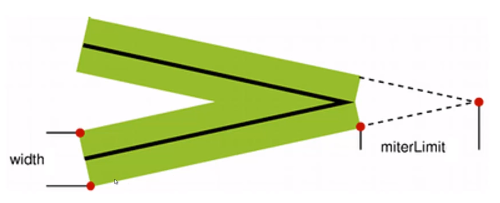

import FeatureIcon from "@site/src/components/FeatureIcon";
import ReferenceList from "@site/src/components/ReferenceList";
import html from "@site/static/img/icon/html.png";

<FeatureIcon src={html} title="Canvas" />

# Canvas

获取 `canvas` 元素，然后通过 `context` 对象进行绘制

```html
<canvas id="canvas"></canvas>
```

```javascript
var canvas = document.getElementById("canvas");
var context = canvas.getContext("2d");
// 使用 context 进行绘制
```

## API

通常而言，后绘制的图形会覆盖前面的图形。

| Name                                    | 描述                                                                                                                                 |
| --------------------------------------- | ------------------------------------------------------------------------------------------------------------------------------------ |
| context.moveTo(x,y)                     | 移动画笔至(x,y)                                                                                                                      |
| context.lineTo(x,y)                     | 从当前位置画线至(x,y)                                                                                                                |
| context.lineWidth                       | 线条属性，线宽                                                                                                                       |
| context.strokeStyle                     | 画笔颜色                                                                                                                             |
| context.stroke()                        | 基于当前状态画线                                                                                                                     |
| context.beginPath()                     | 声明开始全新的路径绘制。绘制封闭多边形的起始语句。                                                                                   |
| context.closePath()                     | 表明当前路径需要封闭，会自动将路径封闭。绘制封闭多边形的终止语句。                                                                   |
| context.fill()                          | 基于当前路径进行填充，会自动将路径封闭。                                                                                             |
| context.fillStyle                       | 填充样式                                                                                                                             |
| context.rect(x, y, width, height)       | 直接绘制矩形路径                                                                                                                     |
| context.fillRect(x, y, width, height)   | 规划路径并绘制                                                                                                                       |
| context.strokeRect(x, y, width, height) | 规划路径并填充                                                                                                                       |
| context.lineCap                         | 线条属性，线段两端的表现：butt(default)/round/square。只能作用于路径两端，对于衔接处不生效。                                         |
| context.lineJoin                        | 线条属性，线段相交时的表现：miter(default)/bevel/round。                                                                             |
| context.miterLimit                      | 仅在 lineJoin 为 miter 时生效 |
| context.save()                          | 保存绘图状态状态，和 restore() 成对出现                                                                                              |
| context.restore()                       | 恢复绘图状态状态，不受到前面画布状态的影响。和 save() 成对出现                                                                       |
|                                         |                                                                                                                                      |
|                                         |                                                                                                                                      |

## 图形变换

实质上是对坐标系进行变换

- 位移: translate(x, y)
- 旋转: rotate(deg)
- 缩放: scale(sx, sy)

## Color

- #ffffff

- #fff
- rgb(255,128,0)
- rgba(100, 100, 100, 0.5)
- hsl(20, 62%, 28%)
- hsla(20, 62%, 28%, 0.6)
- red

### 五角星

五角星可以看成是在两个嵌套的圆上找点

```javascript
function drawStar(ctx, r, R, x, y, rotate) {
  ctx.beginPath();
  for (let i = 0; i < 5; i++) {
    ctx.lineTo(
      Math.cos(((18 + i * 72 - rotate) / 180) * Math.PI) * R + x,
      -Math.sin(((18 + i * 72 - rotate) / 180) * Math.PI) * R + y
    );
    ctx.lineTo(
      Math.cos(((54 + i * 72 - rotate) / 180) * Math.PI) * r + x,
      -Math.sin(((54 + i * 72 - rotate) / 180) * Math.PI) * r + y
    );
  }
  ctx.closePath();
  ctx.fillStyle = "#fb3";
  ctx.strokeStyle = "#fd5";
  ctx.lineWidth = 3;
  ctx.lineJoin = "round";
  ctx.stroke();
  ctx.fill();
}
```

<ReferenceList data={[
{
title: "My Sandbox",
link: "https://codesandbox.io/s/canvas-jzpmxe?file=/index.html",
src: html,
},
{
title: "MDN Canvas 教程",
link: "https://developer.mozilla.org/zh-CN/docs/Web/API/Canvas_API/Tutorial",
src: html,
},
{
title: "Canvas 绘图详解",
link: "https://www.imooc.com/learn/185",
src: html,
},
]}
/>
