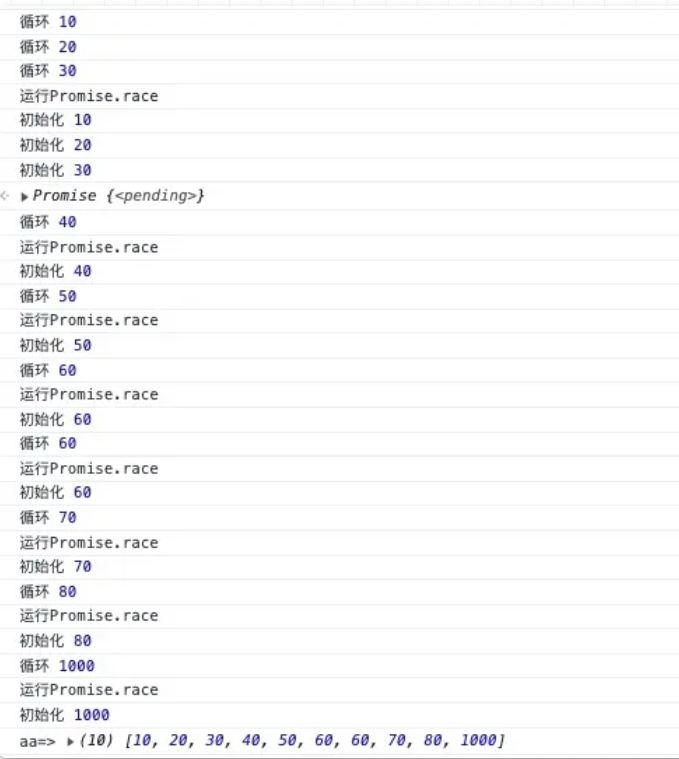

所谓并发请求，就是指在一个时间点多个请求同时执行。当并发的请求超过一定数量时，会造成网络堵塞，服务器压力大崩溃或者其他高并发问题，此时需要限制并发请求的数量。

异步并发数限制问题还是比较容易理解，假设我们某个页面有 10 个接口数据需要请求，现在考虑到网络并发通道阻塞问题，现在需要限制这 10 个接口请求时最多一次性 3 个在处理，当最大请求次数超过 3 个时，未处理的接口只能等待。当有接口数据请求完成后，立即将请求资源给其余接口使用。这个处理是不是很像操作系统的线程任务队列。

场景： 现在提供 10 个 id 和请求函数（请求返回 promise 对象），现在要求你设置一个并发数（假设为 3），达到并发设置效果。


**测试方法**

```js
let request = (delay, id) => {
    return new Promise((resolve) => {
        setTimeout(resolve, delay, id)
    })
}
let test_requests = [
    request(6000, 1),
    request(3000, 2),
    request(4000, 3),
    request(6000, 4),
    request(1000, 5),
    request(2000, 6),
]
```

> 意思就是先发并发数的请求，然后每有一个请求回调结束接着发呗，保证同一时刻最多三个请求在处理过程中。

## Promise 版本

思路： 

1. 每层递归都往 run 里加请求
2. 递归过程中，如果 run 达到临界，使用`Promise.race`来触发递归。
3. 请求的回调为从 run 中删除 自身
4. 递归终点是所有的 request 都已经加完，返回 resolve。此时，就像盗梦空间一样，这个resolve会不断的被返回。（此刻，请求并没有结束）。最外层会接受这个 resolve，使用`Promise.all`等待所有请求结束，执行回调函数。

```js
function requestWithLimit(requesets = [], max = 1, callback = () => {}) {
    let run = []
    let next = 0
    let executor = () => {
        if (next === requesets.length) {  // 递归终止条件 
            return Promise.resolve()
        }
        let currentRequest = requesets[next++]  // 获取请求 
        run.push(
            currentRequest.then(requestRes => { // 请求推入到run数组中
                console.log(requestRes) 
                run.splice(run.indexOf(currentRequest), 1) // 删掉自己
            })
        )

        let res = null
        if (run.length === max) {
            res = Promise.race(run) // 需要等待一个请求到达
        } else {
            res = Promise.resolve() // 不需要等待
        }
        return res.then(()= > executor()) // 向下递归
    }
    
    executor().then(() => { 
        // 此时 run 里的请求还没结束 
        Promise.all(run).then(() => callback())
    })
}
requestWithLimit(test_requests, 3, () => console.log("requeset end"))
```

## Async+Promise.race

思路：递归算法都有迭代写法。实际上这个题目，使用迭代更好理解。 这里使用await语法来实现 run 满的等待。 await promise 会暂停函数执行，直到 promise 成功。 这里的逻辑非常简单，就是遍历请求数组，把它们加到run 中。但是，由于max的存在，需要在 `run.length === max` 时，使用await等待，race到达。同样，添加完后，需要等待 run 里所有请求结束，然后执行回调函数。

```js
async function requestWithLimit(requesets = [], max = 1, callback = () => { }) {
    let run = [], i = 0;
    for (const request of requesets) { // 数组遍历
        run.push(request.then((requesetRes) => { // 依次 推入到 run
            console.log(requesetRes)
            run.splice(run.indexOf(request), 1)
        }))
        if (run.length === max) { 
            console.log('wait')
            await Promise.race(run) // 等待 race 到达。
        }
    }
    Promise.all(run).then(() => callback())
}
requestWithLimit(test_requests, 3, () => console.log("requeset end"))
```

## asyncPool

asyncPool(concurrency, iterable, iteratorFn)


- 创建异步函数，接受三个参数（限制数量、数据数组、处理函数）；
- 函数内部执行处理逻辑；
- 初始化结果数组、运行执行数组变量 ；
- 循环数据数组，包裹处理函数为`Promise对象`；
- 添加`Promise对象`到结果数组（之后的`Promise对象`执行结果仍保存在结果数组中）；
- 判断数据数组的长度是否小于等于限制数量；
  - 如果是继续限量执行；
  - 在当前的`Promise对象`其后添加删除自身的处理逻辑（清除执行数组）；
  - 将当前的`Promise对象`添加到执行数组中；
  - 判断执行数组长度是否大于等于限制数量；
    - 为真，则运行`Promise.race(执行数组)`，进入微任务队列；
    - 为假，跳过；
  - 不是则跳过；

- 使用`Promise.all`全量执行结果数组并返回结果；

- 返回运行结果；

```js
const asyncPool = async (poolLimit, array, iteratorFn) => {
  const resultList = [];
  const executing = [];
  for (const item of array) {
    console.log("循环", item);
    const p = Promise.resolve().then(() => {
      console.log("初始化", item);
      return iteratorFn(item, array);
    });
    resultList.push(p);
    if (poolLimit <= array.length) {
      const e = p.then(() => {
        return executing.splice(executing.indexOf(e), 1);
      });
      executing.push(e);
      if (executing.length >= poolLimit) {
        console.log("运行Promise.race");
        await Promise.race(executing);
      }
    }
  }
  return Promise.all(resultList);
};
```

**示例**

```js
const timeout = (i) =>
  new Promise( (resolve) => {
    setTimeout(resolve, i, i)
  });

const main = async () => {
  const aa = await asyncPool(
    3,
    [10, 20, 30, 40, 50, 60, 60, 70, 80, 1000,],
    timeout
  );
  console.log("aa=>", aa);
};

main();
```

结果：函数运行，一直保持在限制运行数量为3。



