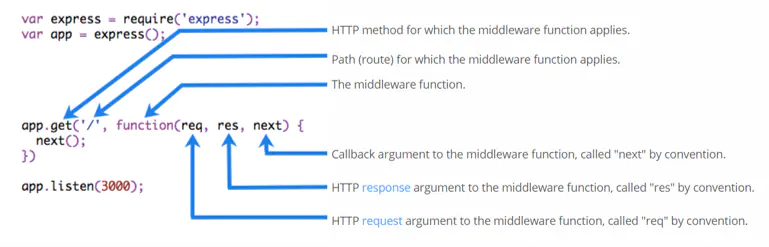

import FeatureIcon from "@site/src/components/FeatureIcon";
import LinkList from "@site/src/components/LinkList";
import expressjs from "@site/static/img/icon/expressjs.png";

<FeatureIcon src={expressjs} title="Express 中间件" />


## 什么是中间件

中间件（Middleware），特指**业务流程的中间处理环节**。

### 中间件的调用流程

当一个请求到达 Express 的服务器之后，可以**连续调用多个中间件**（上一次中间件的输出为下一次中间件的输入），从而对这次请求进行**预处理**。

### 中间件的格式

Express 的中间件，本质上就是一个 function 处理函数，Express 中间件的格式如下：



注意：中间件函数的形参列表中，必须包含 `next` 参数。而路由处理函数中只包含 `req` 和 `res`。

> next 函数是实现**多个中间件连续调用**的关键，它表示把流转关系转交给下一个**中间件**或**路由**。
>


## 中间件的使用

### 定义中间件函数

```js
// 常量 mw 所指向的，就是一个中间件函数
const mw =function(req, res, next){
    console.log('中间件函数')
    //注意:在当前中间件的业务处理完毕后，必须调用next()函数
    //把流转关系，转交给下一个中间件或路由
    next()
}
```

### 全局生效的中间件

客户端发起的任何请求，到达服务器之后，都会触发的中间件，叫做全局生效的中间件。
 通过调用 `app.use(中间件函数)`，即可定义一个全局生效的中间件


```js
//常量 mw所指向的，就是一个中间件函数
const mw =function(req, res, next){
    console.log('中间件函数')
    //注意:在当前中间件的业务处理完毕后，必须调用next()函数
    //把流转关系，转交给下一个中间件或路由
    next()
}

//全局生效的中间件
app.use(mv)
```

或

```js
app.use((req, res, next)=>{
    console.log('中间件函数')
    next()
})
```

### 定义多个全局中间件

可以使用 app.use() 连续定义多个全局中间件。客户端请求到达服务器之后，会按照中间件定义的先后顺序依次进行调用


```js
app.use((req, res, next)=>{
    console.log('中间件函数1')
    next()
})
app.use((req, res, next)=>{
    console.log('中间件函数2')
    next()
})
```

### 中间件的作用

多个中间件之间，共享同一份 `req` 和 `res`。基于这样的特性，我们可以在**上游的中间件中**，统一为 `req` 或 `res` 对象添加**自定义的属性或方法**，供**下游的中间件或路由进行使用**。


```js
app.use((req, res, next)=>{
    //获取请求到达服务器的时间
    const time = Date.now()
    //为 req 对象挂载自定义属性，从而把时间共享给后面的所有路由
    req.startTime = time
    next()
})
app.get('/',(req, res)=>{
    res.send('home page.' + req.startTime)
})
app.get('/user',(req, res)=>{
    res.send('user page.' + req.startTime)
})
```

### 局部生效的中间件

不使用 `app.use()` 定义的中间件，叫做局部生效的中间件


```js
const mw1 =function(req, res, next){
    console.log('中间件函数')
    next()
}
//mw1这个中间件只在"当前路由中生效"，这种用法属于"局部生效的中间件"
app.get('/', mv1, function(req, res){
    res.send('home page.')
})
//mw1这个中间件不会影响下面这个路由
app.get('/user', function(req, res){
    res.send('user page.')
})
```

### 定义多个局部中间件

可以在路由中，通过如下两种等价的方式，使用多个局部中间件


```js
app.get('/', mv1, mv2, function(req, res){
    res.send('home page.')
})
app.get('/', [mv1, mv2], function(req, res){
    res.send('home page.')
})
```

### 中间件的5个使用注意事项

- 一定要在路由之前注册中间件
- 客户端发送过来的请求，可以连续调用多个中间件进行处理
- 执行完中间件的业务代码之后，不要忘记调用 `next()` 函数
- 为了防止代码逻辑混乱，调用 `next()` 函数后不要再写额外的代码
- 连续调用多个中间件时，多个中间件之间，共享 `req` 和 `res` 对象

## 中间件的分类

Express 官方把常见的中间件用法，分成了 5 大类，分别是：

- 应用级别的中间件
- 路由级别的中间件
- 错误级别的中间件
- Express 内置的中间件
- 第三方的中间件

### 应用级别的中间件

通过 `app.use()` 或 `app.get()` 或 `app.post()` ，绑定到 app 实例上的中间件，叫做应用级别的中间件


```js
// 全局中间件
app.use((req, res, next)=>{
    console.log('中间件函数')
    next()
})
//局部中间件
app.get('/', mv1, function(req, res){
    res.send('home page.')
})
```

### 路由级别的中间件

绑定到 `express.Router()` 实例上的中间件，叫做路由级别的中间件。它的用法和应用级别中间件没有任何区别。只不过，应用级别中间件是绑定到 `app` 实例上，路由级别中间件绑定到 `router` 实例上


```js
var app = express()
var router = express.Router()

router.use((req, res, next)=>{
    console.log('Time:', Date.now())
    next()
})
app.use('/',router)
```

### 错误级别的中间件

错误级别中间件的**作用**：专门用来捕获整个项目中发生的异常错误，从而防止项目异常崩溃的问题。

**格式**：错误级别中间件的 function 处理函数中，必须有 4 个形参，形参顺序从前到后，分别是 `(err, req, res, next)`。


```js
//路由
app.get('/', (req, res)=>{
    //抛出一个自定义错误，提示错误信息
    throw new Error('服务器内部发生了错误！')
    //下面这行代码不会执行
    res.send('Home page.')
})
//错误级别的中间件
app.use((err, req, res, next)=>{
    //服务器打印错误消息
    console.log('发生了错误：' + err.message)
    //向客户端响应错误信息
    res.send('Error!' + err.message)
})
```

注意：错误级别的中间件，必须注册在所有路由之后！

### Express内置的中间件

自 Express 4.16.0 版本开始，Express 内置了 3 个常用的中间件，极大的提高了 Express 项目的开发效率和体验：

- `express.static` 快速托管静态资源的内置中间件，例如： HTML 文件、图片、CSS 样式等（无兼容性）
- `express.json` 解析 JSON 格式的请求体数据（有兼容性，仅在 4.16.0+ 版本中可用）
- `express.urlencoded` 解析 URL-encoded 格式的请求体数据（有兼容性，仅在 4.16.0+ 版本中可用）


```js
//配置解析 application/json格式数据的内置中间件
app.use(express.json())
//配置解析application/x-www-form-urlencoded格式数据的内置中间件  
app.use(express.urlencoded({ extended: false }))
```

### 第三方的中间件

非 Express 官方内置的，而是由第三方开发出来的中间件，叫做第三方中间件。在项目中，可以按需下载并配置第三方中间件，从而提高项目的开发效率。

例如：在 `express@4.16.0` 之前的版本中，经常使用 `body-parser` 这个第三方中间件，来解析请求体数据。


```bash
# 运行 npm install body-parser 安装中间件
npm i body-parser
```


```js
//使用 require 导入中间件
const parser = require('body-parser')
//调用 app.use() 注册并使用中间件
app.use(parser.urlencoded({ extended: false }))
```

注意：Express 内置的 `express.urlencoded` 中间件，就是基于 `body-parser` 这个第三方中间件进一步封装出来的。

## 自定义中间件

自己手动模拟一个类似于 `express.urlencoded` 这样的中间件，来解析 POST 提交到服务器的表单数据。

实现步骤：

- 定义中间件
   使用 app.use() 来定义全局生效的中间件
- 监听 req 的 data 事件
   在中间件中，需要监听 req 对象的 data 事件，来获取客户端发送到服务器的数据。
   如果数据量比较大，无法一次性发送完毕，则客户端会把**数据切割后，分批发送到服务器**。所以 data 事件可能会触发多次，每一次触发 data 事件时，获取到数据只是**完整数据的一部分**，需要手动对接收到的数据进行拼接。
- 监听 req 的 end 事件
   当请求体数据接收完毕之后，会自动触发 req 的 end 事件。
   因此，我们可以在 req 的 end 事件中，**拿到并处理完整的请求体数据**。
- 使用 querystring 模块解析请求体数据
   Node.js 内置了一个 `querystring` 模块，专门用来**处理查询字符串**。通过这个模块提供的 `parse()` 函数，可以轻松把查询字符串，解析成对象的格式。
- 将解析出来的数据对象挂载为 req.body
   上游的中间件和下游的中间件及路由之间，**共享同一份** `req` 和 `res`。因此，我们可以将解析出来的数据，挂载为 req 的自定义属性，命名为 `req.body`，供下游使用。
- 将自定义中间件封装为模块
   为了优化代码的结构，我们可以把自定义的中间件函数，封装为独立的模块。


```js
//custom-body-parser.js

// 导入 Node.js 内置的 querystring 模块
const qs = require('querystring')

const bodyParser = (req, res, next) => {
  // 定义中间件具体的业务逻辑
  // 1. 定义一个 str 字符串，专门用来存储客户端发送过来的请求体数据
  let str = ''
  // 2. 监听 req 的 data 事件
  req.on('data', (chunk) => {
    str += chunk
  })
  // 3. 监听 req 的 end 事件
  req.on('end', () => {
    // 在 str 中存放的是完整的请求体数据
    // console.log(str)
    // TODO: 把字符串格式的请求体数据，解析成对象格式
    const body = qs.parse(str)
    req.body = body
    next()
  })
}

module.exports = bodyParser
```


```js
// 导入 express 模块
const express = require('express')
// 创建 express 的服务器实例
const app = express()

// 1. 导入自己封装的中间件模块
const customBodyParser = require('./custom-body-parser')
// 2. 将自定义的中间件函数，注册为全局可用的中间件
app.use(customBodyParser)

app.post('/user', (req, res) => {
  res.send(req.body)
})

// 调用 app.listen 方法，指定端口号并启动web服务器
app.listen(80, function () {
  console.log('Express server running at http://127.0.0.1')
})
```

## 使用 Express 写接口

- 创建基本的服务器
- 创建 API 路由模块
- 编写 GET 接口
- 编写 POST 接口
- ...

注意：如果要获取 URL-encoded 格式的请求体数据，必须配置中间件 `app.use(express.urlencoded({ extended: false }))`


```js
//apiRouter.js

const express = require('express')
const router = express.Router()

// 在这里挂载对应的路由
router.get('/get', (req, res) => {
  // 通过 req.query 获取客户端通过查询字符串，发送到服务器的数据
  const query = req.query
  // 调用 res.send() 方法，向客户端响应处理的结果
  res.send({
    status: 0, // 0 表示处理成功，1 表示处理失败
    msg: 'GET 请求成功！', // 状态的描述
    data: query, // 需要响应给客户端的数据
  })
})

// 定义 POST 接口
router.post('/post', (req, res) => {
  // 通过 req.body 获取请求体中包含的 url-encoded 格式的数据
  const body = req.body
  // 调用 res.send() 方法，向客户端响应结果
  res.send({
    status: 0,
    msg: 'POST 请求成功！',
    data: body,
  })
})

// 定义 DELETE 接口
router.delete('/delete', (req, res) => {
  res.send({
    status: 0,
    msg: 'DELETE请求成功',
  })
})

module.exports = router
```


```js
// 导入 express
const express = require('express')
// 创建服务器实例
const app = express()

// 配置解析表单数据的中间件
app.use(express.urlencoded({ extended: false }))

// 必须在配置 cors 中间件之前，配置 JSONP 的接口
app.get('/api/jsonp', (req, res) => {
  // TODO: 定义 JSONP 接口具体的实现过程
  // 1. 得到函数的名称
  const funcName = req.query.callback
  // 2. 定义要发送到客户端的数据对象
  const data = { name: 'zs', age: 22 }
  // 3. 拼接出一个函数的调用
  const scriptStr = `${funcName}(${JSON.stringify(data)})`
  // 4. 把拼接的字符串，响应给客户端
  res.send(scriptStr)
})

// 一定要在路由之前，配置 cors 这个中间件，从而解决接口跨域的问题
const cors = require('cors')
app.use(cors())

// 导入路由模块
const router = require('./16.apiRouter')
// 把路由模块，注册到 app 上
app.use('/api', router)

// 启动服务器
app.listen(80, () => {
  console.log('express server running at http://127.0.0.1')
})
```


```html
  <body>
    <button id="btnGET">GET</button>
    <button id="btnPOST">POST</button>
    <button id="btnDelete">DELETE</button>
    <button id="btnJSONP">JSONP</button>

    <script>
      $(function () {
        // 1. 测试GET接口
        $('#btnGET').on('click', function () {
          $.ajax({
            type: 'GET',
            url: 'http://127.0.0.1/api/get',
            data: { name: 'zs', age: 20 },
            success: function (res) {
              console.log(res)
            },
          })
        })
        // 2. 测试POST接口
        $('#btnPOST').on('click', function () {
          $.ajax({
            type: 'POST',
            url: 'http://127.0.0.1/api/post',
            data: { bookname: '水浒传', author: '施耐庵' },
            success: function (res) {
              console.log(res)
            },
          })
        })

        // 3. 为删除按钮绑定点击事件处理函数
        $('#btnDelete').on('click', function () {
          $.ajax({
            type: 'DELETE',
            url: 'http://127.0.0.1/api/delete',
            success: function (res) {
              console.log(res)
            },
          })
        })

        // 4. 为 JSONP 按钮绑定点击事件处理函数
        $('#btnJSONP').on('click', function () {
          $.ajax({
            type: 'GET',
            url: 'http://127.0.0.1/api/jsonp',
            dataType: 'jsonp',
            success: function (res) {
              console.log(res)
            },
          })
        })
      })
    </script>
  </body>
```

### CORS 跨域资源共享

刚才编写的 GET 和 POST接口，存在一个很严重的问题：不支持跨域请求。

解决接口跨域问题的方案主要有两种：

- **CORS**（主流的解决方案，推荐使用）
- **JSONP**（有缺陷的解决方案：只支持 GET 请求）

#### 使用 cors 中间件解决跨域问题

cors 是 Express 的一个第三方中间件。通过安装和配置 cors 中间件，可以很方便地解决跨域问题。

使用步骤分为如下 3 步：

- 运行 `npm install cors` 安装中间件
- 使用 `const cors = require('cors')` 导入中间件
- 在路由之前调用 `app.use(cors())` 配置中间件

#### 什么是 CORS

CORS （Cross-Origin Resource Sharing，跨域资源共享）由一系列 **HTTP 响应头**组成，这些 HTTP 响应头决定浏览器是否阻止前端 JS 代码跨域获取资源。

浏览器的**同源安全策略**默认会阻止网页“跨域”获取资源。但如果接口服务器配置了 CORS 相关的 HTTP 响应头，就可以解除浏览器端的跨域访问限制。

#### CORS 的注意事项

- CORS 主要在**服务器端**进行配置。**客户端浏览器无须做任何额外的配置**，即可请求开启了 CORS 的接口。
- CORS 在浏览器中**有兼容性**。只有支持 XMLHttpRequest Level2 的浏览器，才能正常访问开启了 CORS 的服务端接口（例如：IE10+、Chrome4+、FireFox3.5+）。

#### CORS 响应头部 - Access-Control-Allow-Origin

响应头部中可以携带一个 `Access-Control-Allow-Origin` 字段，其语法如下:


```js
Access-Control-Allow-Origin: <origin> | *
```

其中，origin 参数的值指定了**允许访问该资源的外域 URL**。

例如，下面的字段值将只允许来自 `http://itcast.cn` 的请求：


```js
res.setHeader( 'Access-Control-Allow-Origin' , 'http://itcast.cn')
```

如果指定了 Access-Control-Allow-Origin 字段的值为`通配符 *`，表示允许来自任何域的请求，示例代码如下：


```js
res.setHeader( 'Access-Control-Allow-Origin' , '*')
```

#### CORS 响应头部 - Access-Control-Allow-Headers

默认情况下，CORS 仅支持客户端向服务器发送如下的 9 个请求头：

Accept、Accept-Language、Content-Language、DPR、Downlink、Save-Data、Viewport-Width、Width 、Content-Type （值仅限于 text/plain、multipart/form-data、application/x-www-form-urlencoded 三者之一）

如果客户端向服务器发送了额外的请求头信息，则需要在服务器端，通过 Access-Control-Allow-Headers 对额外的请求头进行声明，否则这次请求会失败！


```js
//允许客户端额外向服务器发送 Content-Type 请求头和 X-Custom-Header 请求头
//注意:多个请头之间使用英文的逗号进行分割
res.setHeader ('Access-Control-Allow-Headers' ,'Content-Type, X-Custom-Header')
```

#### CORS 响应头部 - Access-Control-Allow-Methods

默认情况下，CORS 仅支持客户端发起 GET、POST、HEAD 请求。

如果客户端希望通过 **PUT**、**DELETE** 等方式请求服务器的资源，则需要在服务器端，通过 `Access-Control-Alow-Methods`来指明实际请求所允许使用的 HTTP 方法。

示例代码如下：


```js
//只允许POST、GET、DELETE、HEAD请求方法
res.setHeader('Access-Control-Allow-Methods', 'POST，GET，DELETE，HEAD')
//允许所有的 HTTP请求方法
res.setHeader('Access-Control-Allow-Methods', '*')
```

#### CORS请求的分类

客户端在请求 CORS 接口时，根据请求方式和请求头的不同，可以将 CORS 的请求分为两大类，分别是：

- 简单请求
- 预检请求

##### 简单请求

同时满足以下两大条件的请求，就属于简单请求：

- **请求方式**：GET、POST、HEAD 三者之一
- **HTTP 头部信息**不超过以下几种字段：无自定义头部字段、Accept、Accept-Language、Content-Language、DPR、Downlink、Save-Data、Viewport-Width、Width 、Content-Type（只有三个值application/x-www-form-urlencoded、multipart/form-data、text/plain）

客户端与服务器之间只会发生一次请求。

##### 预检请求

只要符合以下任何一个条件的请求，都需要进行预检请求：

- 请求方式为 GET、POST、HEAD 之外的请求 Method 类型
- 请求头中包含自定义头部字段
- 向服务器发送了 `application/json` 格式的数据

在浏览器与服务器正式通信之前，浏览器会先发送 **OPTION** 请求进行预检，以获知服务器是否允许该实际请求，所以这一次的 OPTION 请求称为“**预检请求**”。服务器成功响应预检请求后，才会**发送真正的请求，并且携带真实数据**。

客户端与服务器之间会发生两次请求，OPTION 预检请求成功之后，才会发起真正的请求。

#### JSONP 接口

**概念**：浏览器端通过 `<script>` 标签的 src 属性，请求服务器上的数据，同时，服务器返回一个函数的调用。这种请求数据的方式叫做 JSONP。

**特点**：

- JSONP 不属于真正的 Ajax 请求，因为它没有使用 XMLHttpRequest 这个对象。
- JSONP 仅支持 GET 请求，不支持 POST、PUT、DELETE 等请求。

#### 创建 JSONP 接口的注意事项

如果项目中**已经配置了 CORS 跨域资源共享**，为了**防止冲突**，**必须在配置 CORS 中间件之前声明 JSONP 的接口**。否则 JSONP 接口会被处理成开启了 CORS 的接口。示例代码如下：


```js
//优先创建 JSONP 接口【这个接口不会被处理成 CORS 接口】
app.get('/api/jsonp', (req, res) => { })

//再配置 CORS 中间件【后续的所有接口，都会被处理成 CORS 接口】

app.use(cors())
//这是一个开启了CORS的接口
app.get('/api/get', (req, res) => { })
```

#### 实现 JSONP 接口的步骤

- 获取客户端发送过来的回调函数的名字
- 得到要通过 JSONP 形式发送给客户端的数据
- 根据前两步得到的数据，拼接出一个函数调用的字符串
- 把上一步拼接得到的字符串，响应给客户端的 `<script>` 标签进行解析执行


```js
  // 必须在配置 cors 中间件之前，配置 JSONP 的接口
app.get('/api/jsonp', (req, res) => {
  // TODO: 定义 JSONP 接口具体的实现过程
  // 1. 得到函数的名称
  const funcName = req.query.callback
  // 2. 定义要发送到客户端的数据对象
  const data = { name: 'zs', age: 22 }
  // 3. 拼接出一个函数的调用
  const scriptStr = `${funcName}(${JSON.stringify(data)})`
  // 4. 把拼接的字符串，响应给客户端
  res.send(scriptStr)
})
```

#### 在网页中使用 jQuery 发起 JSONP 请求

```js
$('#btnJSONP').on('click', function () {
          $.ajax({
            type: 'GET',
            url: 'http://127.0.0.1/api/jsonp',
            dataType: 'jsonp',
            success: function (res) {
              console.log(res)
            },
          })
        })
      })    
```