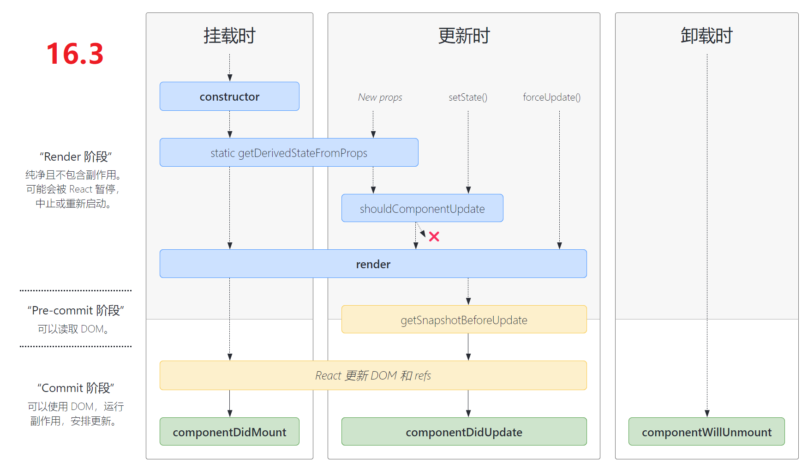
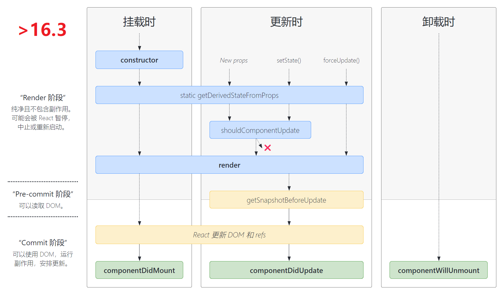

import FeatureIcon from "@site/src/components/FeatureIcon";
import LinkList from "@site/src/components/LinkList";
import ReferenceList from "@site/src/components/ReferenceList";
import react from "@site/static/img/icon/react.png";
import create_react_app from "@site/static/img/icon/create_react_app.png";
import reactrouter from "@site/static/img/icon/react_router.png";
import i18next from "@site/static/img/icon/i18next.png";
import redux from "@site/static/img/icon/redux.png";
import typescript from "@site/static/img/icon/typescript.png";

<FeatureIcon src={react} title="React" />

## 生命周期

[React 生命周期](https://projects.wojtekmaj.pl/react-lifecycle-methods-diagram/)指的是组件从创建到卸载的整个过程每个过程都有对应的钩子函数它主要有以下几个阶段：

1. 挂载阶段组件实例被创建和插入 DOM 树的过程，其生命周期调用顺序如下：
   1. [**`constructor()`**](https://zh-hans.reactjs.org/docs/react-component.html#constructor)
   2. [`static getDerivedStateFromProps()`](https://zh-hans.reactjs.org/docs/react-component.html#static-getderivedstatefromprops)
   3. [**`render()`**](https://zh-hans.reactjs.org/docs/react-component.html#render)
   4. [**`componentDidMount()`**](https://zh-hans.reactjs.org/docs/react-component.html#componentdidmount)
2. 更新阶段组件被重新渲染的过程。当组件的 props 或 state 发生变化时会触发更新。组件更新的生命周期调用顺序如下：
   1. [`static getDerivedStateFromProps()`](https://zh-hans.reactjs.org/docs/react-component.html#static-getderivedstatefromprops)
   2. [`shouldComponentUpdate()`](https://zh-hans.reactjs.org/docs/react-component.html#shouldcomponentupdate)
   3. [**`render()`**](https://zh-hans.reactjs.org/docs/react-component.html#render)
   4. [`getSnapshotBeforeUpdate()`](https://zh-hans.reactjs.org/docs/react-component.html#getsnapshotbeforeupdate)
   5. [**`componentDidUpdate()`**](https://zh-hans.reactjs.org/docs/react-component.html#componentdidupdate)
3. 卸载阶段组件从Dom树中被删除的过程。当组件从 DOM 中移除时会调用如下方法：
   - [**`componentWillUnmount()`**](https://zh-hans.reactjs.org/docs/react-component.html#componentwillunmount)
4. 错误处理。当渲染过程，生命周期，或子组件的构造函数中抛出错误时，会调用如下方法：
   - [`static getDerivedStateFromError()`](https://zh-hans.reactjs.org/docs/react-component.html#static-getderivedstatefromerror)
   - [`componentDidCatch()`](https://zh-hans.reactjs.org/docs/react-component.html#componentdidcatch)

## Fiber是什么？

- Fiber 就是重新实现的堆栈帧，本质上 Fiber 也可以理解为是一个虚拟的堆栈帧，将可中断的任务拆分成多个子任务，通过按照优先级来自由调度子任务，分段更新，从而将之前的同步渲染改为异步渲染。
- 所以我们可以说 Fiber 是一种数据结构(堆栈帧)，也可以说是一种解决可中断的调用任务的一种解决方案，它的特性就是时间分片(time slicing)和暂停(supense)。

<LinkList
  data={[
    {
      title: "Hooks",
      link: "/docs/react/hooks",
      src: react,
    },
    {
      title: "DOM",
      link: "/docs/react/dom",
      src: react,
    },
    {
      title: "样式和 CSS",
      link: "/docs/react/style-and-css",
      src: react,
    },
    {
      title: "组件交互",
      link: "/docs/react/components-interaction",
      src: react,
    },
    {
      title: "解决方案",
      link: "/docs/react/solutions",
      src: react,
    },
    {
      title: "最佳实践",
      link: "/docs/react/best-practice",
      src: react,
    },
    {
      title: "Create React App",
      link: "/docs/react/create-react-app",
      src: create_react_app,
    },
    {
      title: "React Router",
      link: "/docs/react/react-router",
      src: reactrouter,
    },
    {
      title: "React i18next",
      link: "/docs/react/react-i18next",
      src: i18next,
    },
    {
      title: "Redux",
      link: "/docs/react/redux",
      src: redux,
    },
    {
      title: "使用 TypeScript",
      link: "/docs/react/use-typescript",
      src: typescript,
    },
  ]}
/>

## 参考

<ReferenceList
  data={[
    {
      title: "React Docs",
      link: "https://reactjs.org/",
      src: react,
    },
    {
      title: "New React Docs (Beta)",
      link: "https://beta.reactjs.org/",
      src: react,
    },
  ]}
/>

## 资源

<ReferenceList
  data={[
    {
      title: "React Resource",
      link: "https://reactresources.com/",
      src: react,
    },
  ]}
/>
