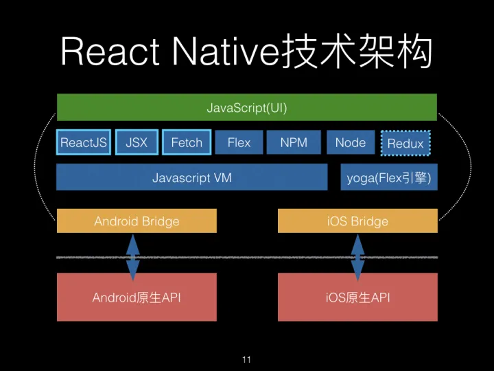

import FeatureIcon from "@site/src/components/FeatureIcon";
import LinkList from "@site/src/components/LinkList";
import react from "@site/static/img/icon/react.png";
import ReferenceList from "@site/src/components/ReferenceList";

<FeatureIcon src={react} title="React Native" />
<LinkList data={[]} />

由于 React Native 提供的组件是对原生 API 的暴露，虽然我们使用的是 JavaScript 语言编写的代码，但是实际上是调用了原生的 API 和原生的 UI 组件。因此，体验和性能足以媲美原生应用。

## React Native 原理

### **JavaScriptCore**

JavaScriptCore 是 JavaScript 引擎，通常会被叫做虚拟机，专门设计来解释和执行 JavaScript 代码。在 React Native 里面，JavaScriptCore 负责 bundle 产出的 JS 代码的解析和执行。

**JS Engine**

React Native 需要一个 JS 的运行环境，因为 React Native 会把应用的 JS 代码编译成一个 JS 文件（x x.bundle），React Native 框架的目标就是解释运行这个 JS 脚本文件，如果是 Native 拓展的 API，则直接通过 bridge 调用 Native 方法，最基础的比如绘制 UI 界面，映射 Virtual DOM 到真实的 UI 组件中。

绿色的是我们应用开发的部分，我们写的代码基本上都是在这一层。

蓝色代表公用的跨平台的代码和工具引擎，一般我们不会动蓝色部分的代码。

黄色代表平台相关的 bridge 代码，做定制化的时候会添加修改代码。

红色代表系统平台的功能，另外红色上面有一个虚线，表示所有平台相关的东西都通过 bridge 隔离开来了，红色部分是独立于 React Native 的。

### **Bridge**

在 React Native 中，原生端和 JavaScript 交互是通过 Bridge 进行的，Bridge 的作用就是给 React Native 内嵌的 JS Engine 提供原生接口的扩展供 JS 调用。所有的本地存储、图片资源访问、图形图像绘制、3D 加速、网络访问、震动效果、NFC、原生控件绘制、地图、定位、通知等都是通过 Bridge 封装成 JS 接口以后注入 JS Engine 供 JS 调用。理论上，任何原生代码能实现的效果都可以通过 Bridge 封装成 JS 可以调用的组件和方法, 以 JS 模块的形式提供给 RN 使用。

**三个线程**

在 React Native 里面，真正有三个重要的线程在执行，他们分别是 Shadow thread、UI thread 和 JS thread。

**JS thread：** 其实是 JavaScript 线程，负责 JS 和原生代码的交互线程，因为 JS 是单线程模型，所以需要一个单独的线程来驱动，并且 JS 和 Native 交互是异步的。

**Shadow thread**: 这个线程是负责 Native 布局，提供给 yoga 引擎使用。

**UI thread**：这个可以看作是主线程，可以看作是 UI Manager 线程，负责页面的交互和控件绘制逻辑。

## 参考

<ReferenceList
  data={[
    {
      title: "React Native 中文文档",
      link: "https://www.reactnative.cn/",
      src: react,
    },
    {
      title: "React Native 原理",
      link: "https://zhuanlan.zhihu.com/p/343519887",
      src: react,
    },
  ]}
/>
