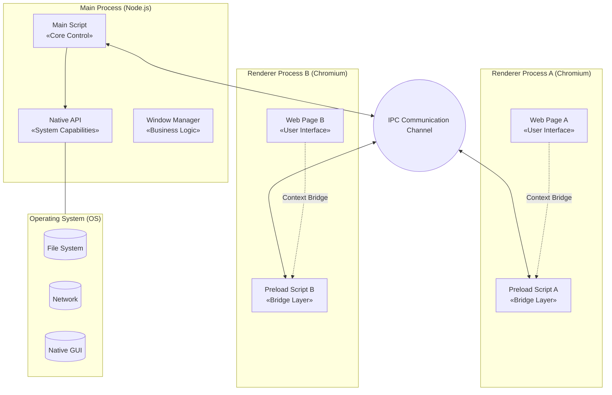
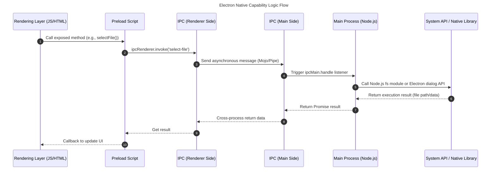
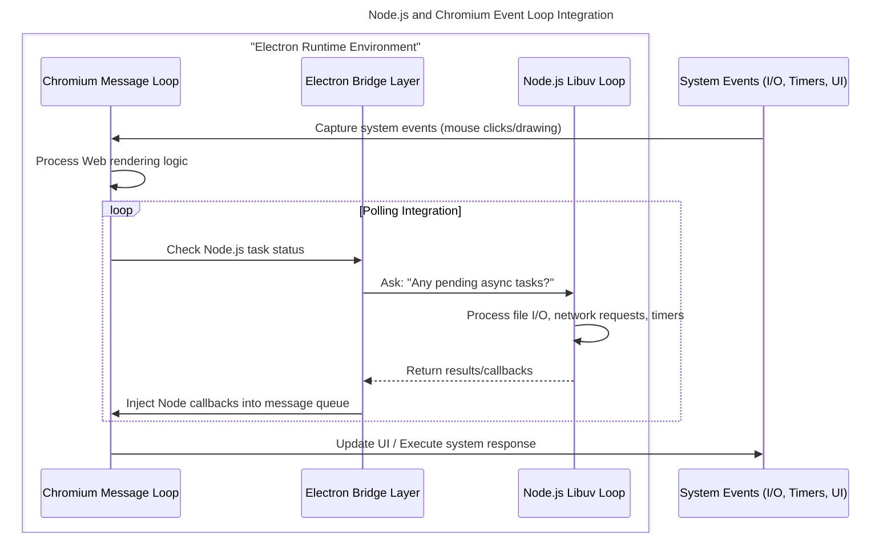

# The Paradigm of Desktop Development: Electron Notes

## 1. Prologue: Why Do We Need Electron?

If you are a frontend developer or a beginner just getting into programming, you probably use VS Code to write code, Discord or Slack to communicate, and Notion to take notes every day. Have you ever wondered why these desktop applications, which offer excellent user experiences, look so much like web pages?

The answer is: **They are essentially web pages.**

This is the magic of **Electron**.

### 1.1 The Pain Points of Cross-Platform Development

Before Electron came along, developing desktop software that could run simultaneously on Windows, macOS, and Linux was a nightmare:

- **Windows**: You needed to learn C# (.NET) or C++.
- **macOS**: You needed to learn Objective-C or Swift.
- **Linux**: You needed to learn C++ (Qt/GTK).

This meant development costs were multiplied by three. Meanwhile, web technologies (HTML/CSS/JS) have the largest developer community globally, and interface iteration is extremely fast.

### 1.2 The Birth and Core Value of Electron

GitHub created Electron to build the Atom editor (the predecessor to VS Code). Its core philosophy is very straightforward:

> **Package the Chrome browser and Node.js together into one box.**

- **Chromium**: Responsible for displaying beautiful interfaces (UI).
- **Node.js**: Responsible for interacting with the underlying system (reading/writing files, network communication).

Thus, web developers can directly use their familiar JavaScript to draw native-level desktop applications.

---

## 2. Core Architecture: Unveiling Electron's Operating Mechanism

Electron isn't just a simple "wrapper" around web pages. It has designed a unique **multi-process architecture**, which is slightly complex, but we can use a metaphor to understand it.

Imagine Electron is a **company**:

1. **Main Process — The Company CEO**
   - **Quantity**: Only one.
   - **Responsibilities**: Holds the highest authority. It is responsible for hiring employees (creating windows), managing company resources (file system, menu bar, system tray), and handling emergencies (lifecycle management).
   - **Capabilities**: Based on Node.js, it can freely manipulate the underlying computer system.
2. **Renderer Process — Department Employees**
   - **Quantity**: Each window (web page) is an employee, and there can be multiple.
   - **Responsibilities**: Only responsible for making the interface look good (HTML/CSS/JS rendering).
   - **Capabilities**: Based on Chromium, for security reasons, it is usually restricted to a "sandbox" and cannot freely read or write computer files.

### 2.1 How Do They Communicate? (IPC Mechanism)

The CEO and employees are not in the same room (process isolation) and cannot speak directly. They must communicate through a special **internal telephone line**, which is **IPC (Inter-Process Communication)**.

- **IPC Main**: The telephone on the Main Process side.
- **IPC Renderer**: The telephone on the Renderer Process side.
  

### 2.2 Example Code

For security, the official recommendation now is to use `ContextBridge`. This is like setting up a "reception room" between the employees and the CEO to prevent external hackers from directly controlling the CEO through web pages.

1. **Main Process (CEO)**: Listens for requests.

   ```js
   // main.js
   const { ipcMain } = require("electron");
   // Listen for the 'get-system-info' request
   ipcMain.handle("get-system-info", async () => {
     return { platform: process.platform };
   });
   ```

2. **Preload Script (Reception Room)**: Exposes secure methods.

   ```js
   // preload.js
   const { contextBridge, ipcRenderer } = require("electron");
   // Expose an object named electronAPI to the web page
   contextBridge.exposeInMainWorld("electronAPI", {
     getStats: () => ipcRenderer.invoke("get-system-info"),
   });
   ```

3. **Renderer Process (Employee)**: Calls the method.

   ```js
   // renderer.js
   const info = await window.electronAPI.getStats();
   console.log(info);
   ```




---

## 3. Design Considerations

### 3.1 Security and Performance Isolation

If Chrome were also a single-process application, it would mean that if one web page you opened crashed, the entire browser would crash. The same applies to Electron:

- **Renderer Process Crash**: Only the current window goes white; the main program is still running, and you can try refreshing to recover.
- **Main Process Crash**: That's truly "game over," and the entire application exits.

### 3.2 Giving Web Native Superpowers

Ordinary browser web pages cannot read `C:\Users\Documents` on your computer. But Electron breaks this limitation through Node.js.

The following flowchart shows how a web page step-by-step obtains files from the operating system:



### 3.3 Integration of Event Loops

One of the most impressive technical challenges of Electron is integrating Node.js's event loop (Libuv) with Chromium's event loop (MessageLoop). If they weren't integrated, Node.js would freeze during UI rendering, and vice versa.



---

## 4. Limitations of Electron

Although developing with Electron is enjoyable, it is not perfect.

### 4.1 "Memory Killer"

Every Electron application essentially comes with a mini version of the Chrome browser.

- **Large Size**: Even a simple Hello World application will be 100MB+ when packaged.
- **Memory Hungry**: Open a few Electron applications (VS Code + Slack + Notion), and your RAM will start screaming.

### 4.2 Security Risks

Early developers, for convenience, liked to enable `nodeIntegration: true`. This is equivalent to hanging your house keys directly on the door handle. If your application loads a malicious web page, hackers can delete your entire hard drive with a single line of JS code.
**The current best practice is: Default to disabling Node integration and use Context Isolation.**

### 4.3 Experience Comparison Table

| Metric | Electron | Tauri | Native Development |
| --- | --- | --- | --- |
| **Package Size** | ~150MB+ (Fat) | ~10MB (Thin) | < 5MB (Lean) |
| **Memory Usage** | ~100MB+ | ~30MB | < 20MB |
| **UI Rendering** | Chromium Engine | System WebView | OS Native Engine |
| **Language** | JS / TS | Rust + JS | C++ / Swift / C# |

> **So, when should you NOT use Electron?**
>
> - **Lightweight Tools**: If you just want to build a simple calculator or sticky note app, stuffing 150MB for such functionality is overkill.
> - **Extremely Performance-Sensitive**: For things like high-frequency trading software or large 3D games, native development is still king.
> - **Old Hardware**: If your target users are still using computers with 4GB of RAM, Electron applications will make them suffer.

---

## 5. The Evolutionary Direction of Electron

### 5.1 ASAR: A Special Archive Format

Electron applications usually consist of thousands of small JavaScript, CSS, and HTML files. When distributing the application, Electron defaults to using the **ASAR (Atom Shell Archive)** format to package these source files into a single file.

- **Solving Windows I/O Bottlenecks**: On the Windows file system (NTFS), the overhead of reading thousands of small files is very high, and it easily triggers the real-time scanning hooks of antivirus software, leading to slow application startup. ASAR merges them into a large file, significantly improving read efficiency.
- **Read-Only and Random Access**: ASAR is similar to a tarball; it **does not compress** and supports random access. This means Electron can directly read specific bytes of a file from the ASAR without unpacking the entire archive.
- **Source Code Protection (Limited)**: Although it slightly hides the source code, preventing users from directly modifying files in the file explorer, it is not an encryption technology. Simple CLI tools can unpack it.

### 5.2 The Deep Waters of Performance Optimization

Besides the native JS performance improvements brought by the V8 engine every year, Electron has more weapons when handling high-performance scenarios:

- **WebAssembly (WASM)**: Through WASM, we can compile high-performance libraries written in C/C++ (like FFmpeg, OpenCV) to run in the renderer process. This allows compute-intensive tasks like video editing and image processing to achieve near-native speeds in Electron (Figma is the best example).
- **Worker Threads**: To avoid blocking the UI rendering main thread, heavy computational tasks (like large file parsing, encryption/decryption) should be placed in Worker threads to execute.
- **Native Addons (C++)**: For performance needs that cannot be met at the Node.js level, developers can write C++ native modules (Node Native Addons) to directly call the underlying OS APIs and interact with JavaScript via N-API.

### 5.3 Strong Challengers: Tauri and Flutter

Electron's dominance is being challenged, mainly by frameworks pursuing extreme size and performance:

1. **Tauri (Rust + Web Frontend)**
   - **Advantages**: Extremely lightweight. It does not package Chromium; instead, it reuses the operating system's built-in WebView (WebView2/Edge on Windows, WebKit on macOS). The installation package is usually only 1/20th the size of Electron.
   - **Disadvantages**: Browser compatibility hell. Because it relies on the system WebView, you cannot guarantee that the user's computer has the latest WebView version. You may need to write Polyfills for rendering differences across different systems. Also, the backend requires Rust knowledge.
2. **Flutter (Dart)**
   - **Advantages**: Comes with its own rendering engine (Skia/Impeller). It does not rely on WebView and directly calls the GPU to draw the UI, offering extremely strong performance and an experience closest to native.
   - **Disadvantages**: Ecosystem isolation. You cannot directly use the vast ocean of JavaScript libraries on NPM; you must use the Dart ecosystem.
3. **Electron's Moat**
   - **Consistency**: Because it comes with Chromium, Electron guarantees **pixel-perfect consistency**. Developers don't have to worry about whether the user's computer is Windows 10 or 11; the web page rendering result is always the same. This is the stability most valued by enterprise-level software.

---

## 6. Conclusion: Should We Still Learn Electron in 2026?

**The answer is yes.**

Although it has the disadvantages of large size and high memory consumption, when it comes to **building complex, highly interactive productivity tools** (like IDEs, design software, collaborative office software), Electron remains the undisputed leader.

Its ecosystem is the most mature, it has the fewest pitfalls, and it can help you build a product and push it to all platforms in the shortest amount of time. For most companies and developers, "development efficiency" and "cross-platform consistency" are far more important than 100MB of hard drive space.
