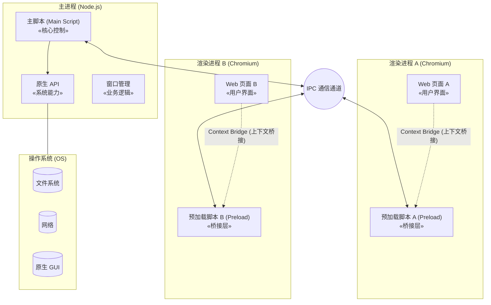
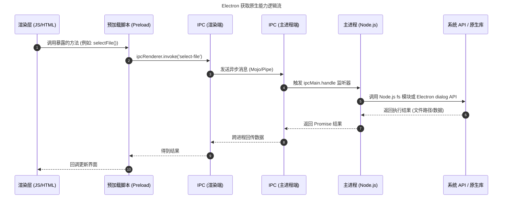
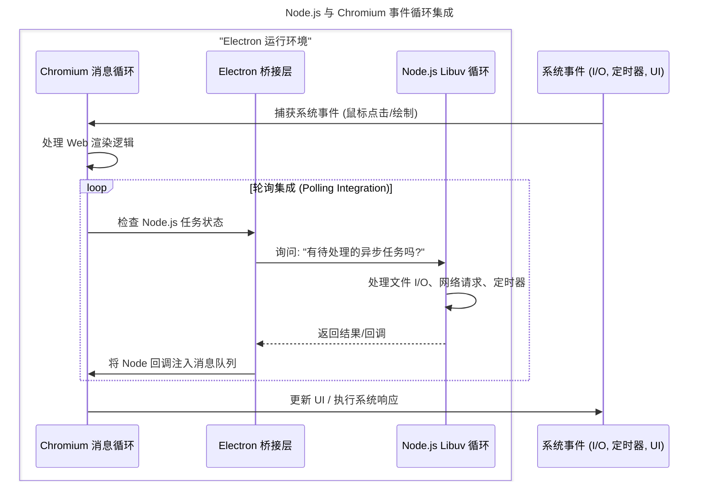

# 桌面开发的范式：Electron 小记

## 1. 序幕：为什么我们需要 Electron？

如果你是一个前端开发者，或者是刚接触编程的新手，你可能每天都在使用 VS Code 写代码，用 Discord 或 Slack 沟通，用 Notion 记笔记。你是否好奇过，为什么这些体验极佳的“桌面应用”，长得那么像网页？

答案是：**它们本质上就是网页。**

这就是 **Electron** 的魔法。

### 1.1 跨平台开发的痛点

在 Electron 出现之前，开发一个同时能在 Windows、macOS 和 Linux 上运行的桌面软件，简直是噩梦：

- **Windows**: 需要学 C# (.NET) 或 C++。
- **macOS**: 需要学 Objective-C 或 Swift。
- **Linux**: 需要学 C++ (Qt/GTK)。

这意味着开发成本要乘以 3。而 Web 技术（HTML/CSS/JS）拥有全球最庞大的开发者群体，且界面迭代速度极快。

### 1.2 Electron 的诞生与核心价值

GitHub 为了打造 Atom 编辑器（VS Code 的前身），创造了 Electron。它的核心理念非常简单粗暴：

> **把 Chrome 浏览器和 Node.js 打包在一起，装进一个盒子里。**

- **Chromium**：负责展示漂亮的界面（UI）。
- **Node.js**：负责接触底层系统（读写文件、网络通信）。

于是，Web 开发者可以直接用自己熟悉的 JavaScript，画出原生级别的桌面应用。

---

## 2. 核心架构：揭秘 Electron 的运行机制

Electron 并不是把网页简单地“套壳”。它设计了一套独特的**多进程架构**，这稍微有点复杂，但我们用一个比喻来理解。

想象 Electron 是一个**公司**：

1. **主进程 (Main Process) —— 公司 CEO**
   - **数量**：只有一个。
   - **职责**：拥有最高权限。它负责招聘员工（创建窗口）、管理公司资源（文件系统、菜单栏、系统托盘）、处理由于生老病死带来的突发状况（生命周期管理）。
   - **能力**：基于 Node.js，可以随意操作电脑底层。
2. **渲染进程 (Renderer Process) —— 部门员工**
   - **数量**：每个窗口（Web 页面）就是一个员工，可以有多个。
   - **职责**：只负责把界面画得好看（HTML/CSS/JS 渲染）。
   - **能力**：基于 Chromium，为了安全，通常被限制在一个“沙盒”里，不能随意读写电脑文件。

### 2.1 它们怎么沟通？(IPC 机制)

CEO 和员工不在同一个房间（进程隔离），不能直接对话。他们必须通过一条特殊的**内部电话线**来沟通，这就是 **IPC (进程间通信)**。

- **IPC Main**: 主进程端的电话。
- **IPC Renderer**: 渲染进程端的电话。
  

### 2.2 示例代码

为了安全，现在官方推荐使用 `ContextBridge`。这就像在员工和 CEO 之间设立一个“传达室”，防止外部黑客通过网页直接控制 CEO。

1. **主进程 (CEO)**: 监听请求。

   ```js
   // main.js
   const { ipcMain } = require("electron");
   // 监听 'get-system-info' 请求
   ipcMain.handle("get-system-info", async () => {
     return { platform: process.platform };
   });
   ```

2. **预加载脚本 (传达室)**: 暴露安全的方法。

   ```js
   // preload.js
   const { contextBridge, ipcRenderer } = require("electron");
   // 给网页暴露一个叫 electronAPI 的对象
   contextBridge.exposeInMainWorld("electronAPI", {
     getStats: () => ipcRenderer.invoke("get-system-info"),
   });
   ```

3. **渲染进程 (员工)**: 调用方法。

   ```js
   // renderer.js
   const info = await window.electronAPI.getStats();
   console.log(info);
   ```




---

## 3. 设计考量

### 3.1 隔离安全与性能

如果 Chrome 也是单进程的，这意味着只要你打开的一个网页崩溃了，整个浏览器就会闪退。Electron 同理：

- **渲染进程崩溃**：只是当前窗口白屏，主程序还在，可以尝试刷新恢复。
- **主进程崩溃**：那是真的“全剧终”，整个应用退出。

### 3.2 赋予 Web 原生超能力

普通的浏览器网页无法读取你电脑上的 `C:\Users\Documents`。但 Electron 通过 Node.js 打破了这个限制。

下面的流程图展示了 Web 页面是如何一步步获取到操作系统的文件的：



### 3.3 事件循环的融合

Electron 最厉害的技术难点之一，是将 Node.js 的事件循环（Libuv）和 Chromium 的事件循环（MessageLoop）融合在一起。如果不融合，UI 渲染的时候 Node.js 就会卡住，反之亦然。



---

## 4. Electron 的局限

虽然 Electron 开发爽，但它也不是完美的。

### 4.1 "内存杀手"

每个 Electron 应用都相当于带了一个迷你版的 Chrome 浏览器。

- **体积大**：哪怕写一个 Hello World，打包出来也得 100MB+。
- **吃内存**：多开几个 Electron 应用（VS Code + Slack + Notion），你的内存条就开始尖叫了。

### 4.2 安全性风险

早期开发者为了图方便，喜欢开启 `nodeIntegration: true`。这相当于把自家的钥匙直接挂在门把手上。如果你的应用加载了一个恶意网页，黑客可以用一行 JS 代码删光你的硬盘。
**现在的最佳实践是：默认关闭 Node 集成，使用 Context Isolation（上下文隔离）。**

### 4.3 体验对比表

| 指标           | Electron      | Tauri                | 原生开发 (Native) |
| -------------- | ------------- | -------------------- | ----------------- |
| **安装包大小** | \~150MB+ (胖) | \~10MB (瘦)          | \< 5MB (精)       |
| **内存占用**   | \~100MB+      | \~30MB               | \< 20MB           |
| **UI 渲染**    | Chromium 内核 | 调用系统自带 WebView | 操作系统原生引擎  |
| **开发语言**   | JS / TS       | Rust + JS            | C++ / Swift / C#  |

> **那么，什么情况下不应该用 Electron？**
>
> - **轻量级工具**：如果你只是想做一个简单的计算器或便签，为了这点功能塞进 150MB 的体积简直是杀鸡用牛刀。
> - **对性能极其敏感**：比如高频交易软件、大型 3D 游戏，原生开发依然是王道。
> - **老旧硬件**：如果你的目标用户还在用 4GB 内存的电脑，Electron 应用会让他们非常痛苦。

---

## 5. Electron 的演进方向

### 5.1 ASAR：一种特殊的归档格式

Electron 应用通常由成千上万个小的 JavaScript、CSS 和 HTML 文件组成。在分发应用时，Electron 默认使用 **ASAR (Atom Shell Archive)** 格式将这些源码打包成一个单一的文件。

- **解决 Windows I/O 瓶颈**：在 Windows 文件系统（NTFS）上，读取成千上万个小文件的开销非常大，且容易触发杀毒软件的实时扫描钩子，导致应用启动缓慢。ASAR 将它们合并为一个大文件，显著提升读取效率。
- **只读与随机访问**：ASAR 类似于 tar 包，它**不进行压缩**，支持随机访问。这意味着 Electron 可以直接从 ASAR 中读取某个文件的特定字节，而无需解压整个包。
- **源码保护（有限）**：虽然它稍微隐藏了源代码，避免用户直接在资源管理器中修改文件，但它并非加密技术，简单的 CLI 工具即可解包。

### 5.2 性能优化的深水区

除了 V8 引擎每年带来的原生 JS 性能提升，Electron 在处理高性能场景时还有更多武器：

- WebAssembly (WASM)：通过 WASM，我们可以将 C/C++ 编写的高性能库（如 FFmpeg、OpenCV）编译后在渲染进程中运行。这让视频剪辑、图像处理等计算密集型任务在 Electron 中达到接近原生的速度（Figma 是最佳案例）。
- Worker Threads：为了不阻塞 UI 渲染主线程，繁重的计算任务（如大文件解析、加密解密）应当放入 Worker 线程中执行。
- Native Addons (C++)：对于 Node.js 层面都无法满足的性能需求，开发者可以编写 C++ 原生模块（Node Native Addons），直接调用操作系统底层 API，通过 N-API 与 JavaScript 交互。

### 5.3 强有力的挑战者：Tauri 与 Flutter

Electron 的霸主地位正在受到挑战，主要来自追求极致体积和性能的框架：

1.  Tauri (Rust + Web 前端)
    - 优势：极度轻量。它不打包 Chromium，而是复用操作系统自带的 WebView（Windows 用 WebView2/Edge，macOS 用 WebKit）。安装包通常只有 Electron 的 1/20。
    - 劣势：浏览器兼容性地狱。因为依赖系统 WebView，你无法保证用户电脑上的 WebView 版本是最新的。你可能需要为不同系统的渲染差异写 Polyfill。且后端需掌握 Rust。
2.  Flutter (Dart)
    - 优势：自带渲染引擎 (Skia/Impeller)。它不依赖 WebView，直接调用 GPU 绘制 UI，性能极强，体验最接近原生。
    - 劣势：生态隔离。无法直接使用 NPM 上浩如烟海的 JavaScript 库，必须使用 Dart 生态。
3.  Electron 的护城河
    - 一致性：因为自带了 Chromium，Electron 保证了**像素级的一致性**。开发者不用担心用户的电脑是 Windows 10 还是 11，网页渲染结果永远一样。这是企业级软件最看重的稳定性。

---

## 6. 总结：2026 年我们还应该学 Electron 吗？

**答案是肯定的。**

虽然它有体积大、吃内存的缺点，但在**构建复杂的、重交互的生产力工具**（如 IDE、设计软件、协同办公软件）方面，Electron 依然是霸主。

它的生态最成熟，坑最少，能在最短时间内把产品做出来并推向所有平台。对于大多数公司和开发者来说，“开发效率”和“跨平台一致性”远比那 100MB 的硬盘空间重要。
